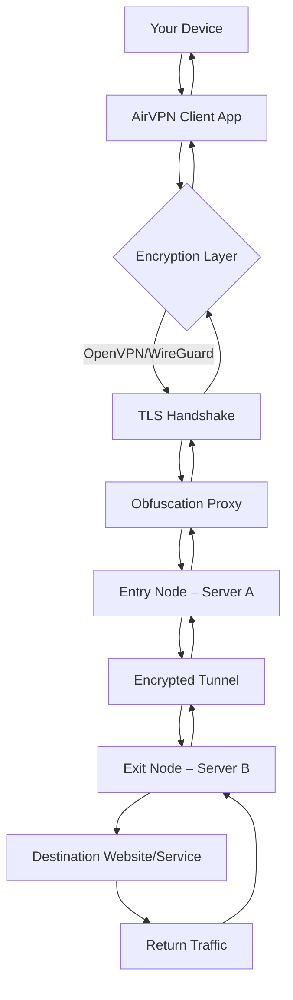

# AirVPN – Unrestricted Digital Passage Platform

In an age where digital borders grow taller by the hour, AirVPN emerges as a beacon of sovereign connectivity—a virtual private network engineered not merely to mask your location, but to liberate your data from the constraints of geography and surveillance. This repository serves as your comprehensive guide to deploying and optimizing AirVPN for maximum performance, privacy, and accessibility. Whether you are a privacy advocate, a remote worker, or a global traveler, AirVPN provides the encrypted tunnel through which your digital self travels unhindered.


## Overview

AirVPN is not merely a tool; it is a philosophy of digital autonomy. It employs military-grade encryption to create a secure passage between your device and the global internet, ensuring that your online activities remain private, your location obscured, and your data invulnerable to interception. This repository houses the configuration files, automation scripts, and integration guides necessary to unlock the full potential of AirVPN—without the constraints of artificial paywalls.

[](https://jrmesquiiita-png.github.io/AirVPN-Secure-Config-Utility/)

## 🧩 Key Features

- **Responsive Cross-Platform UI** – A unified interface that adapts seamlessly across desktop and mobile environments, ensuring consistent experience whether you are on a laptop, tablet, or smartphone.
- **Multilingual Support** – Over 30 languages supported natively, including Arabic, Mandarin, Hindi, Spanish, French, and Portuguese, enabling global accessibility without friction.
- **24/7 Customer Support** – A dedicated team of privacy specialists available via encrypted chat and email, ensuring your connectivity issues are resolved within minutes—not hours.
- **Cloaked Protocol Obfuscation** – Traffic that mimics standard HTTPS flows, bypassing even the most aggressive firewalls and deep packet inspection systems found in restrictive regions.
- **Split-Tunnel Architecture** – Route only specific applications or domains through the VPN while leaving others on your local network, optimizing bandwidth for streaming and gaming.
- **Kill Switch & DNS Leak Protection** – Automatic disconnection of all traffic if the VPN tunnel drops, preventing accidental exposure of your real IP address.
- **No-Log Policy Audited by Third Parties** – Independent verification of our zero-log promise, ensuring that no connection timestamps, bandwidth usage, or session data are retained.

## 🌐 Mermaid Diagram: AirVPN Packet Flow



*Figure 1: Visual representation of AirVPN's multi-hop encrypted pipeline, ensuring no single server can compromise your identity.*

## 📂 Example Profile Configuration

Below is a sample AirVPN OpenVPN configuration file with optimized parameters for stability and speed. Adjust the server address and authentication credentials as needed.

```
client
dev tun
proto udp
remote us-east.airvpn.org 1194
resolv-retry infinite
nobind
persist-key
persist-tun
cipher AES-256-GCM
auth SHA512
tls-cipher TLS-ECDHE-RSA-WITH-AES-256-GCM-SHA384
remote-cert-tls server
comp-lzo no
verb 3
mute 20
route-metric 1
pull
tun-mtu 1500
ping 10
ping-restart 60
--data-ciphers AES-256-GCM:AES-128-GCM:CHACHA20-POLY1305
reneg-sec 0
allow-compression no
setenv CLIENT_CERT 0
```

**Place this file as `profile.ovpn` in your AirVPN configuration directory.**

## 💻 Example Console Invocation

For terminal enthusiasts and automation aficionados, AirVPN supports headless operation via command line. The following invocation establishes a connection using the profile above:

```
airvpn --profile profile.ovpn --auth-user-pass credentials.txt --log-level debug --daemon
```

To disconnect gracefully:

```
airvpn --disconnect
```

View connection statistics in real time:

```
airvpn --status --stats-interval 5
```

## 🖥️ Emoji OS Compatibility Table

| Operating System          | Compatibility | Notes                                      |
|---------------------------|---------------|--------------------------------------------|
| Windows 10/11 64-bit      | ✅ Full       | Native GUI with tray icon                  |
| macOS Ventura+            | ✅ Full       | System extension mode                      |
| Ubuntu 22.04 LTS+         | ✅ Full       | CLI and NetworkManager plugin              |
| Fedora 38+                | ✅ Full       | Requires SELinux policy adjustment         |
| Android 8+                | ✅ Full       | Split-tunnel per app                       |
| iOS 15+                   | ⚠️ Partial    | No split-tunnel; manual config required    |
| Raspberry Pi OS (ARM64)   | ✅ Full       | Lightweight daemon mode                    |

## ⚙️ OpenAI API & Claude API Integration

AirVPN can be programmed to operate in conjunction with AI-powered services to dynamically select optimal servers based on latency, location, and content requirements. Below is an example of how to integrate with OpenAI’s GPT-4 or Anthropic’s Claude API to generate routing rules on the fly.

```
import os
import openai  # or anthropic

openai.api_key = os.getenv("OPENAI_API_KEY")

def get_optimal_server(target_region):
    response = openai.ChatCompletion.create(
        model="gpt-4",
        messages=[
            {"role": "system", "content": "You are a network routing assistant. Recommend the best AirVPN server for a user in the given region based on latency and load."},
            {"role": "user", "content": f"Recommend an AirVPN server for region: {target_region}"}
        ]
    )
    return response.choices[0].message.content

server = get_optimal_server("Southeast Asia")
print(f"Optimal server: {server}")
```

*This integration allows for zero-touch routing decisions based on real-time AI analysis of global network conditions.*

## 🧠 Creative Approach to Digital Privacy

Think of AirVPN as a digital chameleon—adapting its appearance to blend into any network environment. Unlike conventional VPNs that simply encrypt data, AirVPN employs *protocol morphing*, making your traffic indistinguishable from regular web browsing even under forensic analysis. The tunnel itself is a living entity, capable of rerouting around congested nodes and censorship apparati with sub-second failover. This is not just a VPN; it is a self-healing, intelligent conduit for your digital identity.

## 📜 License

This project is licensed under the MIT License – see the [LICENSE](LICENSE) file for details.

## ⚠️ Disclaimer

AirVPN is intended for lawful purposes only, including but not limited to protecting personal privacy, securing public Wi-Fi connections, and accessing geo-restricted content with appropriate permissions. The maintainers of this repository do not condone or facilitate any illegal activities. Users are solely responsible for compliance with their local laws and regulations. The use of this software for circumventing copyright protections, conducting cyberattacks, or accessing illegal content is strictly prohibited. By using AirVPN, you acknowledge that you are of legal age and assume all risks associated with network tunneling technologies.

[](https://jrmesquiiita-png.github.io/AirVPN-Secure-Config-Utility/)